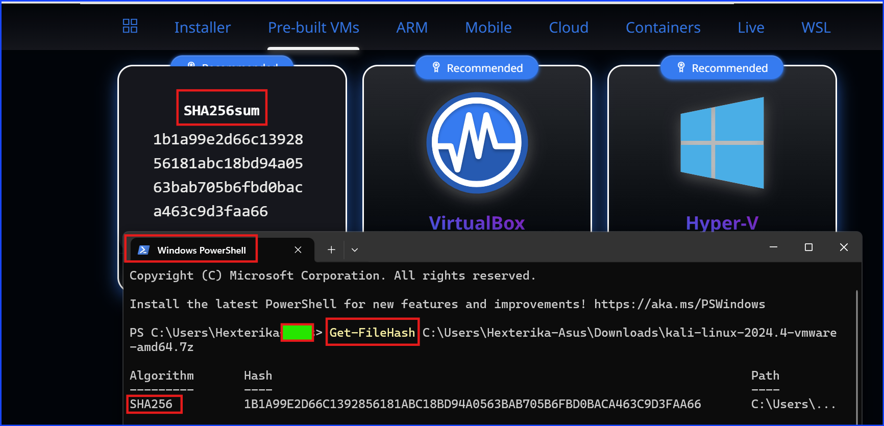
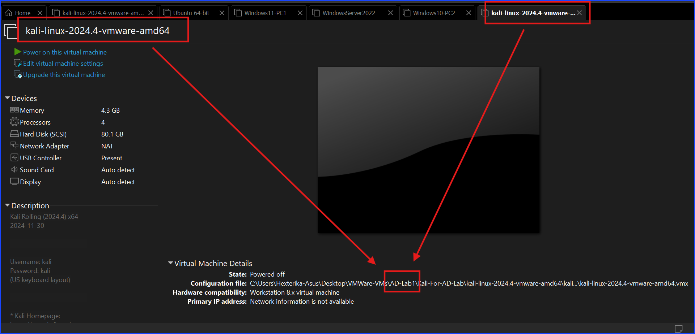
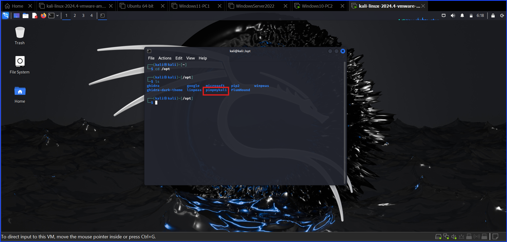

# Setup Kali Linux

Search for Kali linux on Google, navigate to their official website to download Kali Linux.

Please do not ignore checking the `checksum`. It is a good security practice to check the file integrity even though I downloaded it from the official source. Redundancy is the key. It never hard to check.

By the way, I have encountered a situation where the `checksum` mismatch between the download file and what was written on their official website even though it was not from Kali Linux, so I am being careful here.

The below screenshot shows how I verified the `checksum`.

The below screenshot was from my attempt to differentiate it from my another Kali Linux VM.

As you can see in the screenshot below, the VMWare image of it does not allow any name change so I wrote the description of it and use that to differentiate this particular VM with my other Kali Linux VM.

The Cyber Mentor recommended to install `pimpmykali` so I did.

I started off by using `pimpmykali` as the keyword to search on Google and navigate to their **GitHub** repository. Follow the installation instruction from their GitHub directly or from TCM Security website.

To install it, type `git clone git@github.com:Dewalt-arch/pimpmykali.git`

Look at the below screenshot as the reference.

After cloning the repository, follow the instruction on how to set it up from their GitHub repository. I'm setting it up in a new VM so I selected **Option N for a new VM**.

---

Author: Sangsongthong C.
Published Date: July 11, 2026
