# Windows Server Installation on VMWare

First, I started by installing Windows Server on VMWare. I skipped the basic setup until I turned on the Windows Server. I chose the Desktop version to simplify the configuration.

After starting the VM, I see this small size window. To make the VM screen fit correctly to my screen, I navigated to the DVD Drive and double-clicked on the VMWare Tools Setup. Follow all the prompts and let it work its magic. The screenshot below shows which file I am talking about.

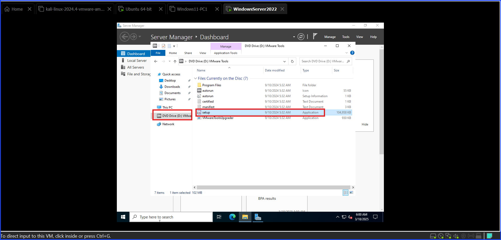

Then, I restarted the Windows Server. Choose "unplanned" as the reason to reboot the server.

To change The Server's PC's Name, click on the Windows logo at the bottom > **View PC Name**.

Then, you will see something like the screenshot below.

Take a look at the Device Name. If it isn't the one you like, change it to something that you can recognize. I chose to name it "THE-SPIDER-DC" from the Phantom Troupe from the Hunter x Hunter as my theme.

To change the PC Name, click on "Rename This PC." A new window will pop up to let you type the new name. Type in the new name and click **Next** as shown in the screenshot below.

The reason for changing the PC Name is so that anyone in the system can easily identify which PC is which.

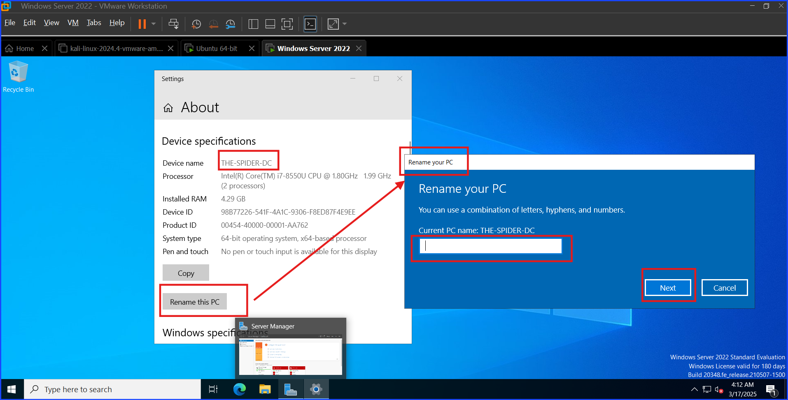

Next, I will move on to configuring **Active Directory (AD)**. Open the **Server Manager**, look at the top right corner, click on **Manage**, select **Add Roles and Features**, and follow the guided prompts.

## Install Active Directory (AD)

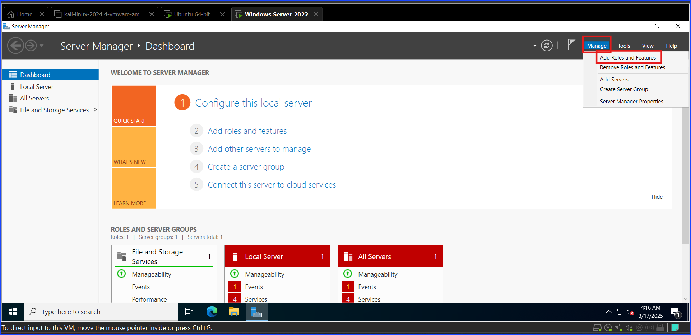

After clicking **Add Roles and Features**, choose the **installation type**. Even though I am on a Virtual Machine, the goal is to learn its functionality as I would use it on a non-VM machine, so I select **Role-based or feature-based installation**.

VM-specific configuration can be addressed separately if needed.

Then, click **Next**. The screenshot below shows the current step I did.

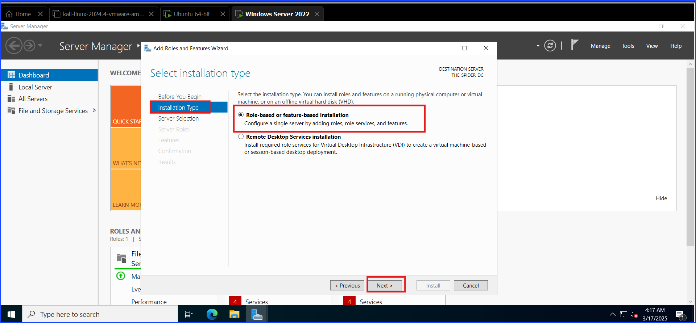

In this step, I decide to select the server from the server pool. As you can see, the system has already detected this machine, **THE-SPIDER-DC** (My PC Name). Click **Next**.

The screenshot below shows the steps I have taken.

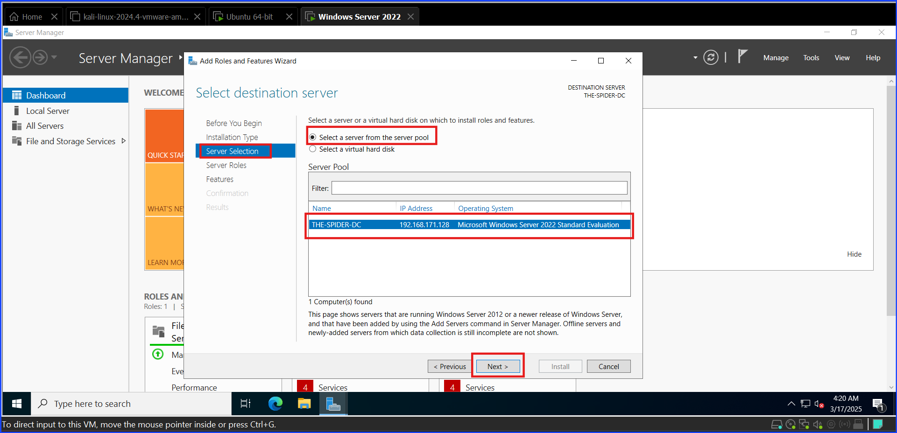

In this step, I am selecting **Active Directory Domain Services**. When the **Add Roles and Features Wizard** window appears, I stick with the default by making no further changes and click **Add Features**, then click **Next**.

The screenshot below shows what I did with arrows.

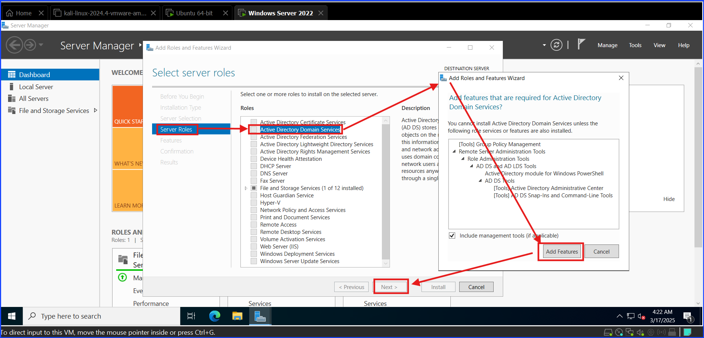

In this step, I accept the default and click **Next**. To show you which step I am on, refer to the screenshot below as a reference.

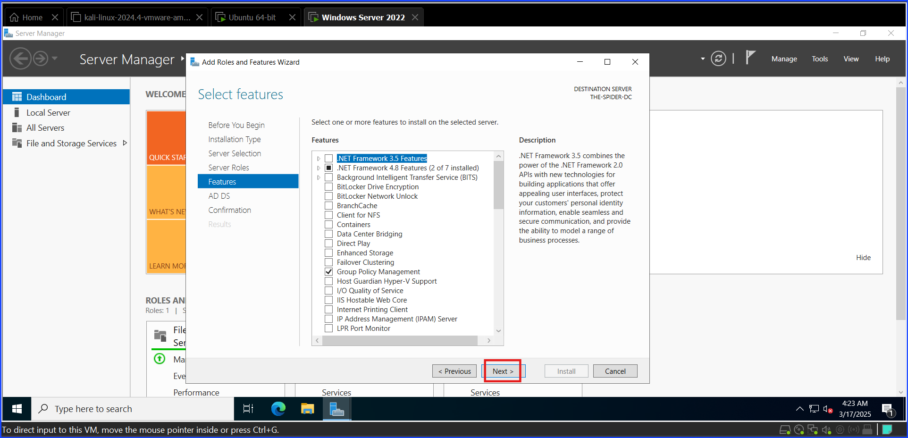

In this step, there is nothing to do except read and click **Next** as shown in the screenshot below.

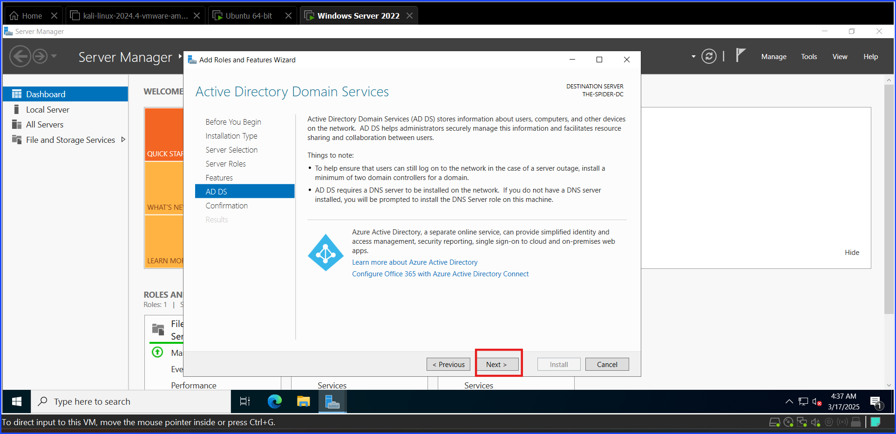

Read through to confirm the settings before installing. If it is correct, click **Install**. To keep track of my steps, use the screenshot below as a reference.

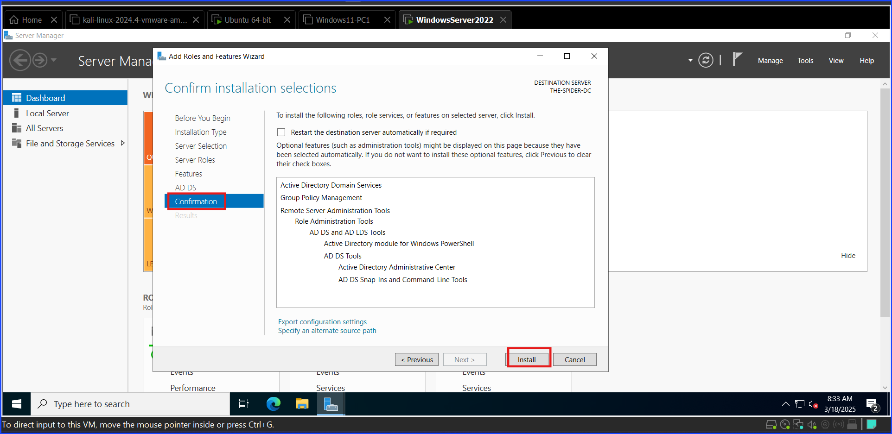

After the installation is finished, click **Close** and restart the machine, as shown in the screenshot below.

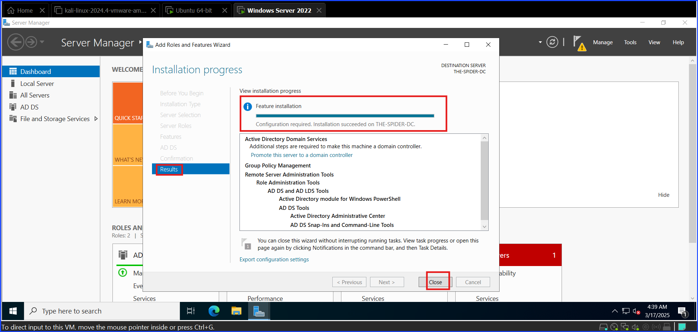

At this point, I have successfully installed Active Directory on this machine.

## Promote To Domain Controller (DC)

This part of the setup involves setting up Active Directory after it has already been installed on this machine.

To help clarify my point, the previous topic involved a blank server without Active Directory (AD) installed, so I installed the AD.

However, in this step, the AD is already installed on the machine. I just need to set it up. Please think of this step as I am telling it what I want it to do.

The first step is to promote the server to be the Domain Controller (DC). The reason for doing this is that without promoting the server to be a Domain Controller, the server remains a standalone machine and cannot fulfill the role of a Domain Controller in an Active Directory environment.

In doing so, it allows the server to:

+ Transforms the server into a functional domain controller (DC) capable of managing the Active Directory domain.
+ Installs and configures the necessary components for AD DS to operate.
+ Establishes or joins the domain and enables authentication, authorization, and replication.
+ Ensures the server can provide critical domain services and support the domain's infrastructure.

To do so, look at the top right corner of the Server Manager window, see a warning flag ⚠️, click on it, and select **Promote this server to a domain controller**.

Please see the screenshot below for reference.

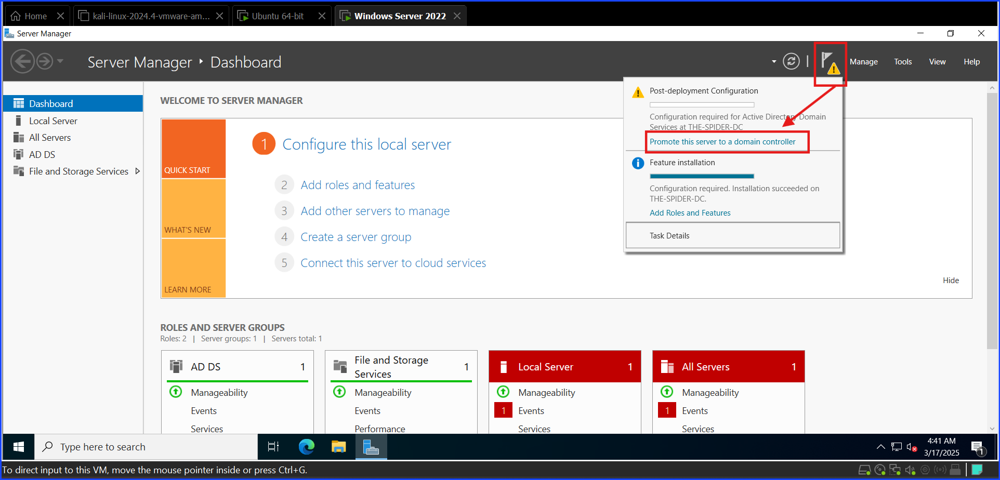

After the previous step, the Active Directory Domain Configuration Wizard will pop up. Under **Deployment Configuration**, select **Add a new forest**, and type in the **root domain name** of the forest. In this case, it is **SPIDER-PT.local**. Then, click **Next**.

The screenshot below shows the steps I took.

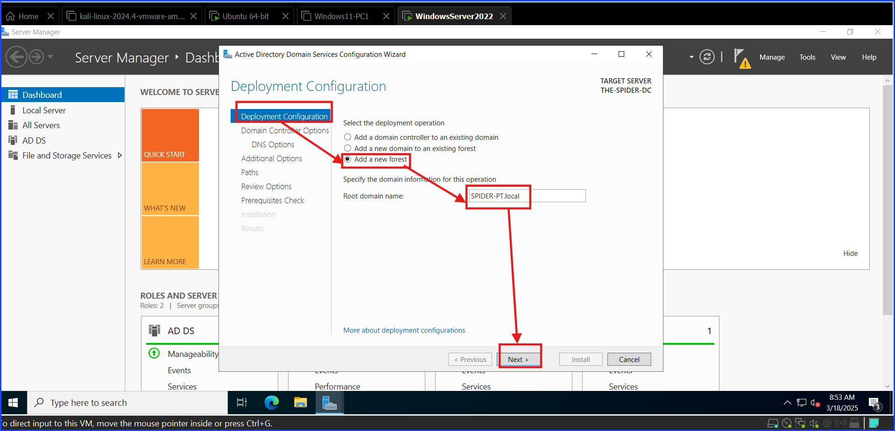

In the **Domain Controller Options** section, enter a chosen password. After that, click **Next**.

As usual, take a look at the reference in the screenshot below.

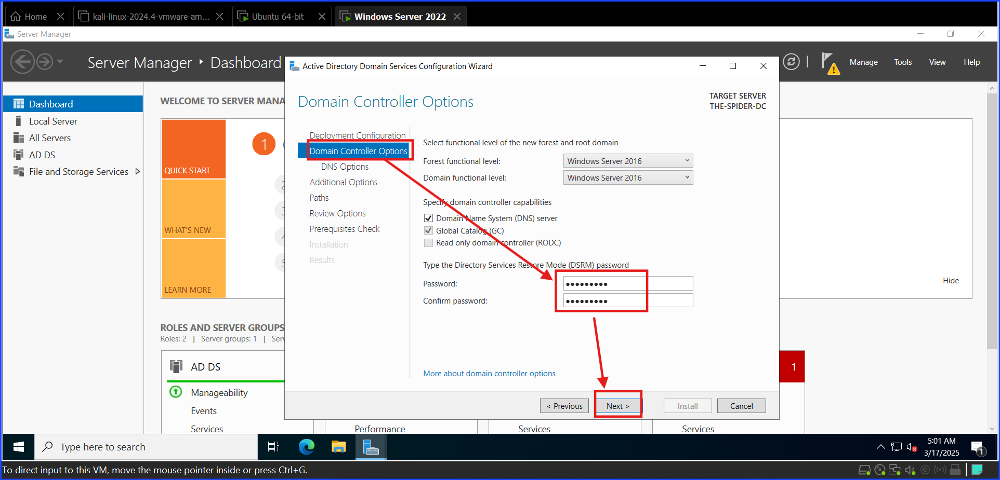

The next step is to configure DNS Options. Accept the default and click **Next**. There is nothing much to do, as shown in the screenshot below.

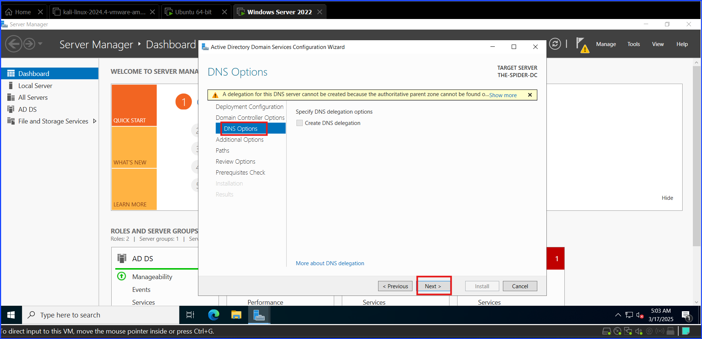

Under the **Additional Options**, make sure that the NetBIOS name matches the **root domain name** from the **Deployment Configuration** step, but without the *.local* part before clicking **Next**.

Take a look at the screenshot below for reference.

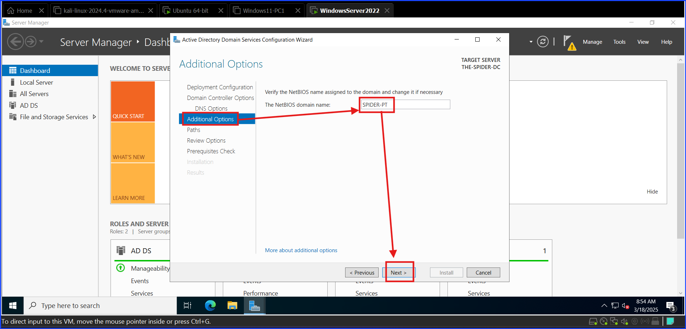

Under **Paths**, take a look at the file paths below and familiarize yourself with them. The Cyber Mentor said they would play important roles later.

Other than familiarizing myself with the paths, I do not need to do anything except click **Next**.

The file paths are visible in the screenshot below.

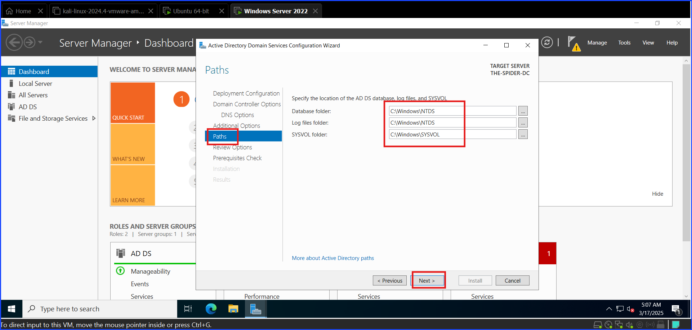

Under the **Review Options**, double check that the **domain name** and the **NetBIOS name** are the same, with the **domain name** having the *.local* while the **NetBIOS name** doesn't have that part.

If both names match, click **Next**.

The screenshot below highlights that I need to check if the **domain name** and the **NetBIOS name** match before clicking **Next**.

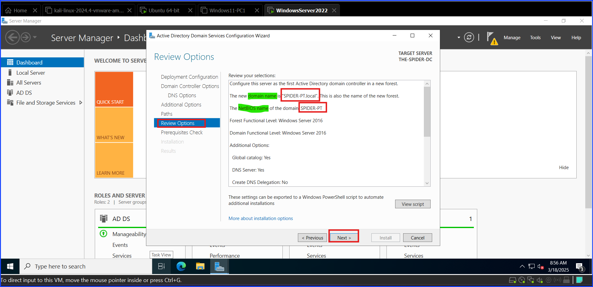

In this step, the **Prerequisites Check**, the system checks for the prerequisites before beginning the installation. Once the check is done, click **Install** to begin the installation process.

The screenshot below shows the success of the prerequisites.

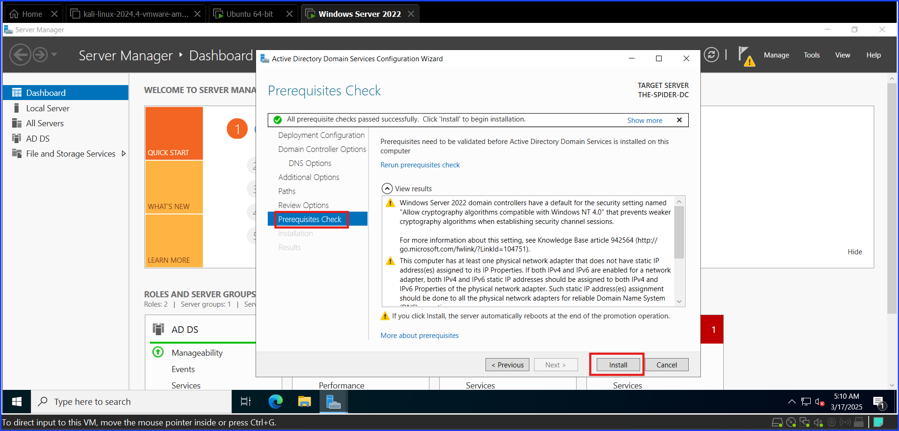

After the installation is finished, restart the machine and try to log in as **SPIDER-PT\Administrator**.

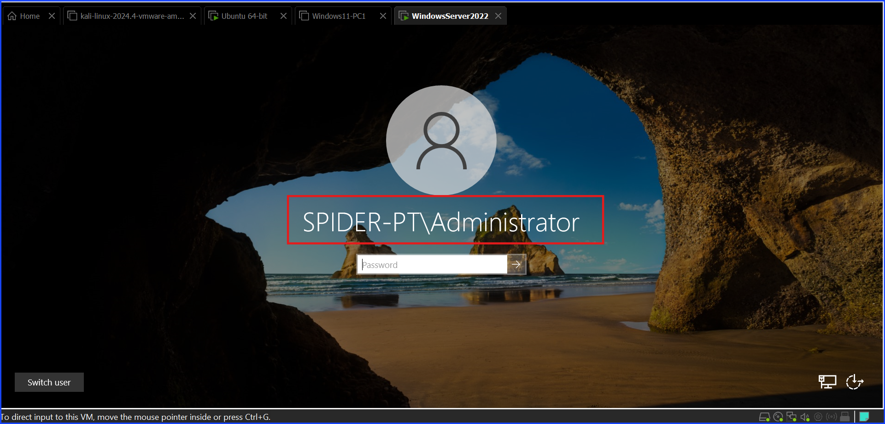

This is it. The process of setting up the Windows Server, configuring the Active Directory, and promoting it to a Domain Controller is complete.

As you can see, if you can log in as `SPIDER-PT\Administrator` after rebooting the system, it means you have set it up correctly.

The important part is that instead of logging in as a **username**, the system shows the **NetBIOS name** + **\** + user.

---

**Author:** Sangsongthong Chantaranothai
